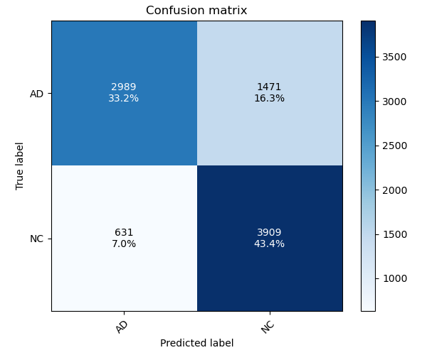

I understand you want the response entirely in **Markdown format**.

Here is the complete, final version of your `README.md` content, incorporating all the discussed structural and content improvements, and formatted exclusively using GitHub Markdown.

-----

# ADNI — GFNet recognition (AD vs NC)

## Short description (problem & algorithm)

This project trains a **GFNet**-based image classifier to distinguish Alzheimer’s Disease (AD) from Normal Control (NC) images derived from the ADNI dataset. GFNet is a vision architecture that replaces standard self-attention with **global frequency-domain filtering** (using FFT-based modules) to capture long-range spatial dependencies efficiently. The problem solved is binary medical image classification: given a preprocessed image, predict whether it belongs to the AD or NC class.

-----

## How it works

Input images are converted to fixed-size patches, embedded, and processed through a stack of GFNet blocks (see `modules.py`). Each block applies a **GlobalFilter** in the frequency domain, followed by an MLP and normalization. The network aggregates patch features to produce a final embedding which is passed to a linear classifier. The training loop (`train.py`) uses **AdamW** optimization with a **CosineAnnealingLR** scheduler and **CrossEntropy** loss. `dataset.py` provides standard image transforms (random resized crop and augmentations for training; resize + center-crop for testing) and loads images using `torchvision.datasets.ImageFolder`.

-----

## Visualisation

Below is a sample confusion matrix produced by evaluating a model saved by running `train.py` on the test set. Generate the figure by running `predict.py` — it will save `confusion_matrix.png` to this folder.

(Note: the model was only able to achieve a test accuracy of 76.6%, just shy of the 80% target)

-----

## Example Inputs and Outputs

This section demonstrates the full training and evaluation workflow via the command line.

### Training (`train.py`)

The script prints per-epoch progress and saves the best model checkpoint based on validation accuracy.

**Input (Command):**

```bash
python train.py
```

**Output (Final Console Snapshot):**

```text
... (intermediate epochs) ...
Epoch 80/80:
  Train Loss: 0.1505 | Train Acc: 93.05%
  Val Loss: 0.7100 | Val Acc: 83.67.50%
  *** Saved best model to best_model.pth with Val Acc: 83.67% ***
```

### Prediction and Evaluation (`predict.py`)

The evaluation script loads `best_model.pth`, runs a full pass over the test set, reports the final aggregate metrics, and generates the confusion matrix plot.

**Input (Command):**

```bash
python predict.py
```

**Output (Final Console Report):**

```text
nModel Evaluation on Test Set - Loss: x.xxxx, Accuracy: x.xx%
```

-----
## Visualisation


Below is a sample confusion matrix produced by evaluating a model saved by running `train.py` on the test set. Generate the figure by

running `predict.py` — it will save `confusion_matrix.png` to this folder.





(Note: the model was only able to achieve a test accuracy of 76.6%, just shy of the 80% target)

## Dependencies & reproducibility

Recommended dependencies (tested):

  * **Python 3.8+**
  * **torch** $\ge$ 1.8.0, **torchvision** $\ge$ 0.9.0
  * **timm** $\ge$ 0.6.11
  * **matplotlib** $\ge$ 3.3.0
  * **numpy** $\ge$ 1.19.0
  * **Pillow (PIL)**

You can install these into a virtual environment (Windows cmd example):

```cmd
python -m venv venv
venv\Scripts\activate
pip install --upgrade pip
pip install torch torchvision timm pillow matplotlib numpy
```

**Reproducibility notes:**

  * `train.py` sets explicit random seeds (`torch.manual_seed(42)` and `torch.cuda.manual_seed_all(42)`) to ensure that identical training runs produce highly similar, predictable results.

-----

## Pre-processing and split justification

### Pre-processing used (in `dataset.py`):

  * **Training transforms:** `RandomResizedCrop(224, scale=(0.7, 1.0))`, `RandomHorizontalFlip`, `RandomRotation(15)`, `ToTensor()`, ImageNet normalization ($\text{mean}=[0.485, 0.456, 0.406]$, $\text{std}=[0.229, 0.224, 0.225]$).
  * **Test transforms:** `Resize(256)`, `CenterCrop(224)`, `ToTensor()`, ImageNet normalization.

### Justification:

  * **ImageNet Normalization:** This normalization is crucial because the GFNet architecture and its **pretrained weights** (`gfnet-xs-pretrained.pth`) were trained using the ImageNet dataset statistics. This ensures the input distribution to the backbone layers remains compatible, accelerating fine-tuning.
  * **Data Augmentation:** Techniques like random crop, flip, and rotation are used during training to artificially increase the size and variability of the dataset. This is a vital strategy to improve **generalization** and robustly reduces **overfitting** on the relatively small ADNI medical image set.
  * **Splits:** `dataset.py` expects labeled folders under `DATA_DIR/train` and `DATA_DIR/test`. This **explicit folder-based split** is used to keep training and test sets strictly separate, guaranteeing that performance metrics are unbiased (i.e., no image used for learning is also used for final evaluation).

-----

## Usage

  * **`train.py` (Top-level constants):** Modify constants like `BATCH_SIZE`, `NUM_EPOCHS`, `LEARNING_RATE`, and `WEIGHT_DECAY` before running. The script prints per-epoch results and saves the best model based on validation accuracy to `best_model.pth`.
  * **`predict.py`:** Once `best_model.pth` is saved, run this script to load the model, evaluate its performance on the entire test set, and output the final validation accuracy and the `confusion_matrix.png` plot.
  * **`modules.py`:** Contains the GFNet implementation and helper functions (`train_epoch`, `validate_epoch`) which are documented with short comments.
  * **`dataset.py`:** Uses `torchvision.datasets.ImageFolder`; class order follows folder alphabetical order, which is accessible via `train_dataset.classes`.

-----

## Files

  * `modules.py` — GFNet implementation and helper functions.
  * `dataset.py` — Data loader and image transforms.
  * `train.py` — Training loop script that saves `best_model.pth`.
  * `predict.py` — Evaluation script that computes and saves `confusion_matrix.png`.
  * `gfnet-xs-pretrained.pth` — Pretrained weights used to initialize the model.
  * `best_model.pth` — The best saved model checkpoint after training.